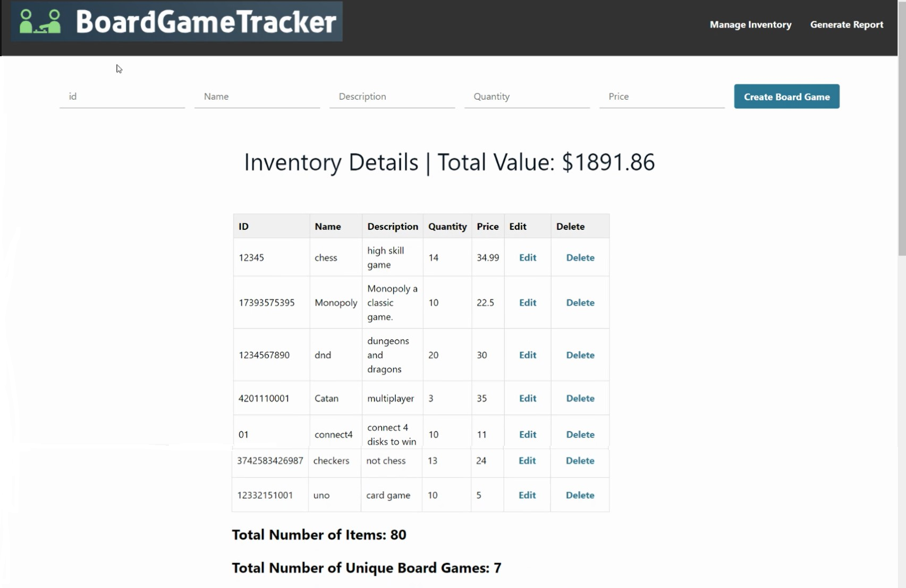

# CS4990-W24-BoardGameTracker

An inventory managment system for board games with CRUD operations. Includes account creation to check and manage your inventory in real time. Generate a pdf copy of your inventory.

Tech stack:
React.js: front-end

AWS Amplify: web hosting with CI/CD deployment.

AWS Cognito: user accounts and user autentication.

GraphQL: API endpoint for queries, strict schema for consistent data access.

S3: storage

## Available Scripts

In the project directory, you can run:
### `npm install`

To install all the necessary packages and dependencies.

### `npm start`

Runs the app in the development mode.\
Open [http://localhost:3000](http://localhost:3000) to view it in your browser.

The page will reload when you make changes.\
You may also see any lint errors in the console.